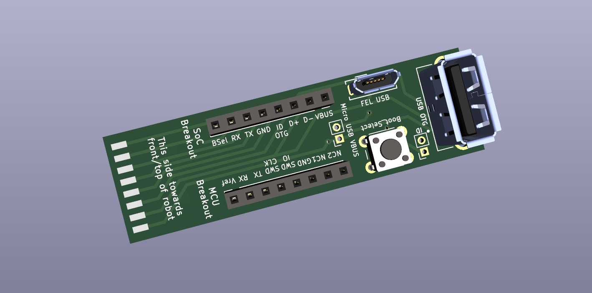
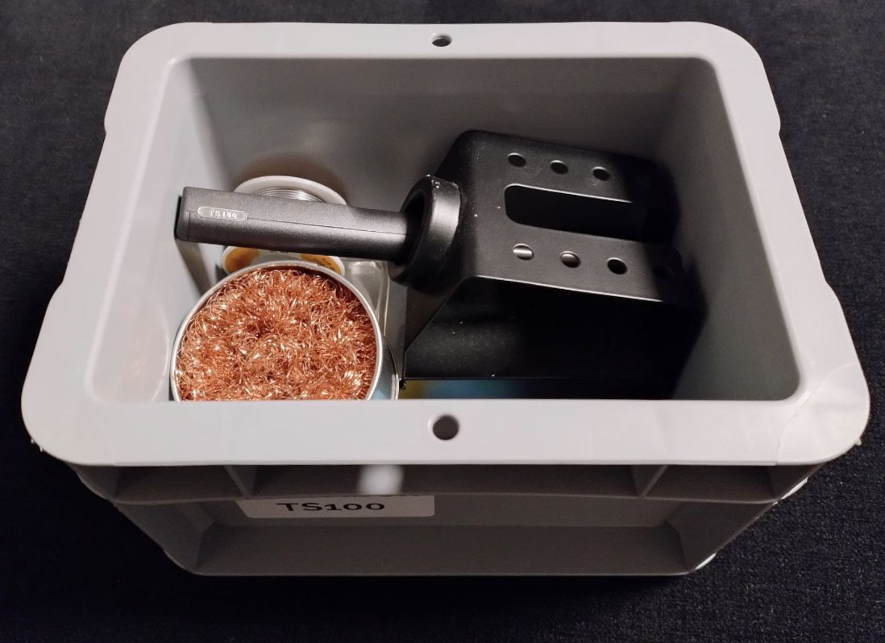

# Dreame Adapter PCBs for Valetudo

This repository contains the resources to build the breakout PCBs required for rooting of Dreame Vacuum robots
as documented in the [Valetudo docs](https://valetudo.cloud).

These are the PCBs (click to jump to their respective readme):
- [Dreame Breakout](./pcbs/dreamebreakout/) - the main one you're looking for (including a step-by-step soldering guide!)
- [Dreame Breakout Breakout](./pcbs/dreamebreakoutbreakout)

Check out the [releases section](https://github.com/Hypfer/valetudo-dreameadapter/releases) to find prebuilt gerber zips
that you can upload to the PCB manufacturer of your choice e.g. JLCPCB, PCBWay, OSHPark, AISLER etc.

While designing these, I made sure to keep them relatively easy to solder by only using THT components so that they
and in turn rooting dreame robots is accessible to more people.

Still, this might not be for everyone. But please keep reading

## Acquiring a PCB

Since we live in an age where there are many cheap hobbyist PCB manufacturing services, the idea behind the PCB is that you
just pick one of those, upload the gerber zip from the releases section and order a set of PCBs for yourself.

As for the components, they're standard parts. Just source them from wherever. Aliexpress, Ebay, Amazon, Digikey, etc.

Within 1-2 weeks or so, you should then receive everything you need and can start soldering the beginner-friendly and easy to solder THT components to the PCB.

## Community building

Because the PCBs are only needed for the initial root (and debugging), the idea is that instead of everyone
having their own, users could share the same PCBs locally with other users so that we not only connect to robots
but also connect to the people around us.

If you
- have built, received or otherwise acquired one of these PCBs and you'd like to help other people root their robots as well

or
- if you're looking for someone with a PCB or maybe general dreame rooting advice near you,

consider joining [the dedicated telegram group](https://t.me/+vuPbtb23w0g0NGIy).

Ideally this would not only enable more people to root their robots but also build a community and provide an opportunity
to meet other people nearby that might share the same interests as you.

We'll see if and how this works out. I think it could be neat

## Acquiring a PCB Kit

If you're located somewhere where no one else has a PCB yet and/or might be unsure on how to order the correct parts,
I have self-soldering kits here in Germany that I tend to ship out to other people within Europe. 
Please note that I'm **not** selling these.

Be aware that preparing and shipping kits is work that takes multiple hours every time that I might not always have at hand.
It's also rather unenjoyable tedious work that I usually do anyway because I enjoy that it brings value to other people.

If you understand that, feel free to ping me via PN to ask about a kit on Telegram (`@NotHypfer`).

Note that this text doesn't state or imply "ping me, and you will for sure receive a kit within 1-3 business days". 
Always remember that I'm just another human being trying to be nice.

Please act accordingly.

## FAQ

### Why can't I order these and use assembly services from e.g. JLCPCB?

Because you should learn how to solder. No, really. 
Soldering is a valuable skill to have in your toolbox and there's no better way to learn something new than being forced
to do so while trying to get something else done.

To make this as easy as possible, everything has been tuned to be easy to solder, only using THT parts.
There's even a step-by-step guide with pictures to completely rule out any confusion or overwhelmement.

This project can do that, because it is entirely luxury fluff. No lives depend on people being able to root their
vacuum robots as quickly and with as little friction as possible.
This is just a hobby and if you're planning on picking up a hobby, you need to actually invest effort into that hobby.

Soldering irons are cheap and there are a lot of guides on the Internets. It is impossible to be able to buy an $800
vacuum robot but don't have any more money to then pick up a used $5 soldering iron or just visit the local makerspace.

 

That said, there are indeed people actually incapable of soldering on their own due to physical disabilities etc.
These are also the people I had in mind when I founded the PCB sharing group so that other users could then help there.

 
Please note that being a mindless consumer is not a disability and thus doesn't warrant any accessibility efforts.
Neither is being a very busy individual that just doesn't have time.

You can't pick up a hobby if you don't have time for that hobby.

### Why are there no pre-soldered PCBs for sale?

Similar to what was stated above, this is a conscious decision to filter out people that don't really care about the
project but just see it as means to an end.
It also filters people who believe that every conceivable problem can be solved with money and not personal growth.

And lastly, it would be a bad idea, because having bought some finished product makes people think that they're a paying
customer which can lead to attitude issues that have no business being anywhere near this project.

### Okay, fine, I'll solder myself. Can you recommend some soldering gear?

Dang, you got me. I'm probably not qualified to recommend stuff, but personally I've been using a MiniWare TS100
running the [Ralim/IronOS](https://github.com/Ralim/IronOS) custom firmware which I bought because
"oh my god a soldering iron that can run a custom firmware". You might be able to relate to that.

It's neat. The digital temperature controls help me greatly and I also quite like how it's so small and can be powered
by any of the many DC power bricks lying around in my living space. Everything I need for soldering fits into a tiny box
that itself fits neatly into an IKEA Billy amongst many other labelled boxes containing small equipment like that.

Nowadays, judging by the IronOS readme, you'd probably want to buy a Pinecil V2 which has DC and USB-C inputs. 
Check the readme of that project for up-to-date recommendations.

You'll then also need some kind of stand for it which will probably be an item the shop you're buying it from
will try to upsell you on anyway. Also, one of these copper sponges to take up excess solder.

For the solder itself, I'm still using lead-based solder. There are serious health considerations there, because there's
no such thing as a healthy amount of lead in your life, but it's also way more forgiving and easier to use than
lead-free solder + flux. 
Don't eat the spool and wash your hands and clean the space afterward.

If you're soldering more stuff, you'll also want to look into fume extraction for which there are off-the-shelf solutions
as well as DIY ideas on the internet.
But just for this one PCB, you can solder outside or probably maybe open a window, point a fan at you and hold your breath? 
Just don't try to actively inhale the solder fumes.

To learn how to solder, consider checking out the [EEVblog tutorial series on YouTube](https://www.youtube.com/watch?v=J5Sb21qbpEQ).
