# Dreame Breakout

This breakout PCB takes the 2.0mm pitch 2x8P dreame debug header and breaks that out into a more usable form.

Specifically it provides
- All pins on two 2.54mm pitch headers for use with regular jumper wires etc
- A micro USB socket for flashing stuff via FEL, Livesuit etc.
- A ~~macro USB~~ USB A socket for USB OTG use
- A button to pull BSel to GND to enter FEL
- A jumper to enable USB OTG

**Important:**  
The PCB needs to be manufactured with 1.2mm thickness or else the robot-facing connector won't fit

## Bill of Materials

All the parts required should be available on Aliexpress or similar

- 1x 2.00mm pitch 2x8P male header
- 2x 2.54mm pitch 1x8P female header
- 1x 6x6mm tactile button
- 1x micro usb port
- 1x usb a port

Optional (can also be done via a regular jumper wire using the larger headers):
- 2x 2.00mm pitch 1x2P male header
- 2x 2.00mm pitch jumper

## Assembly

## Soldering guide 

All images in this guide are also links pointing to a higher-res version of them. Make sure to take advantage of that. 

We'll start with an overview shot of all parts you will need.

[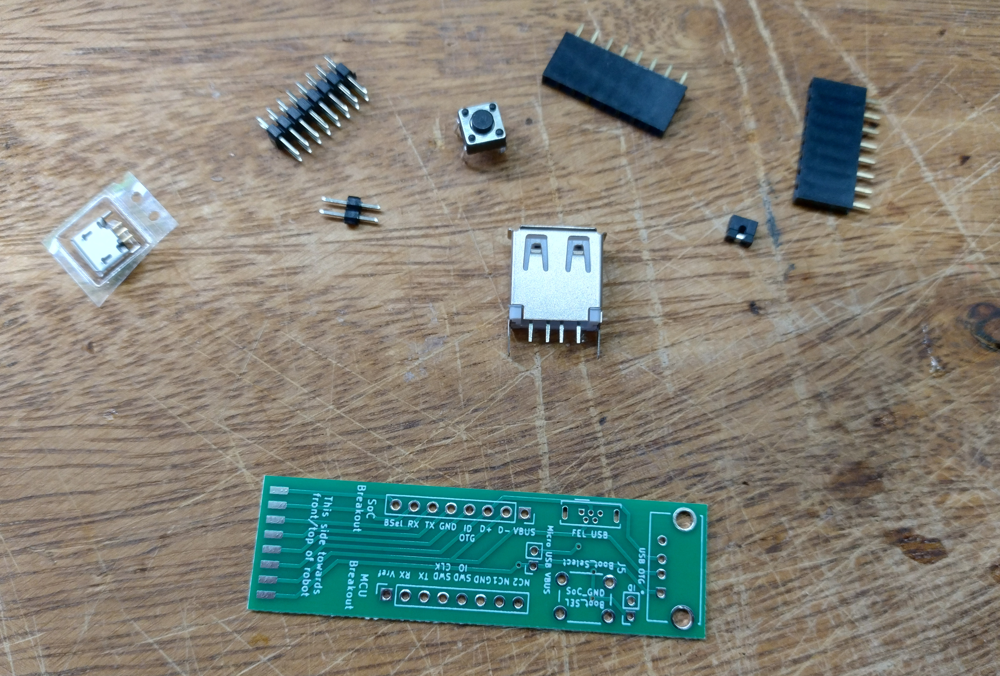](./img/step0.jpg)

As the first step, take the robot-facing header and solder it to the PCB.
Do **only a single outer pin first**, then check the alignment and re-align if needed.

[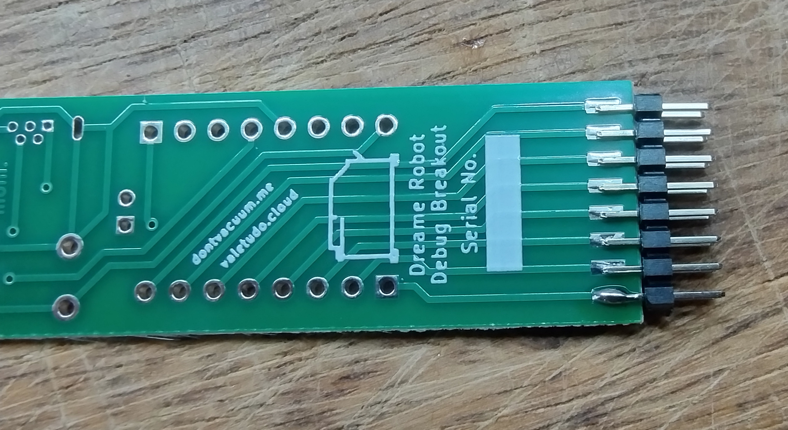](./img/step1.jpg)

Re-aligning with multiple pins soldered will be much harder so make sure to do it correctly.
But also don't worry too much about it as it does not have to be perfect as you can see in the example PCB:

[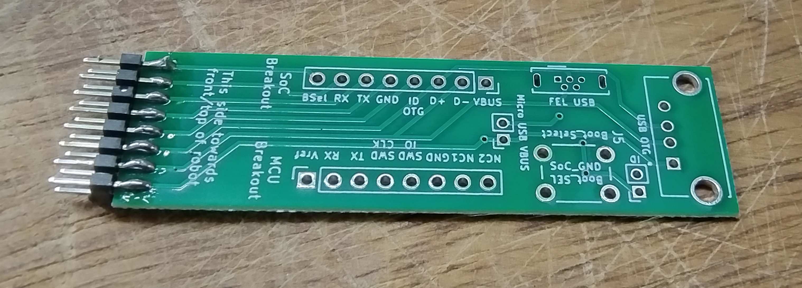](./img/step1.5.jpg)

Next up is the Micro USB port. This is probably the scariest part but actually it's not that hard as you can easily access the only five tiny pins.
Place the port on the PCB and use the USB A port to prop up the PCB to align the Micro USB port correctly.

[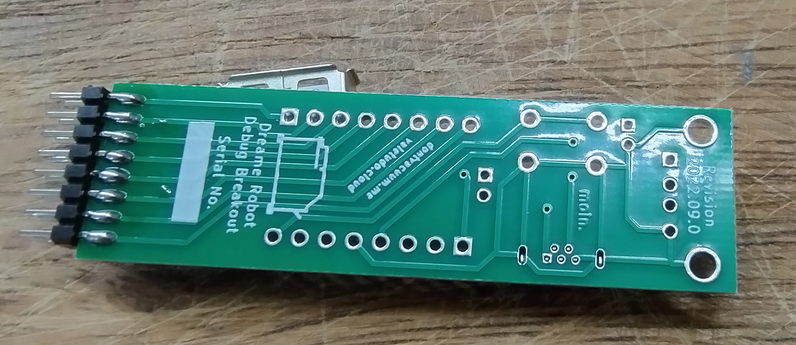](./img/step2.jpg)

Now, start by soldering the two outer large shield connection points to pin the port in place and then check the alignment. Re-align if needed.
After that, solder the five inner pins. Make sure to not bridge them. If you do have a solder bridge, you can get usually
get rid of it by dragging the soldering iron through the pins as the solder will prefer sticking to the iron instead of the pins.

[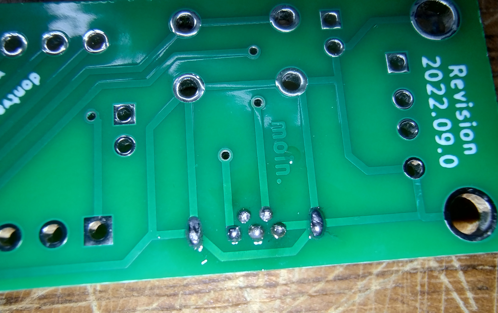](./img/step2.5.jpg)

The next part is the 2-position 2.00mm pitch header for the USB OTG ID jumper.
For that, continue using the USB A port to hold the PCB at the right height and make sure that the header is aligned properly.

[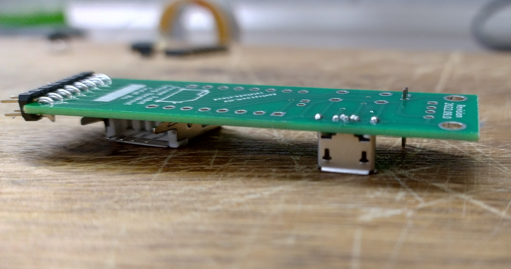](./img/step3.jpg)

Continue by soldering the button to the PCB. Make sure to orient it correctly.
For that, pay close attention to the curvature of its legs in the following picture:

[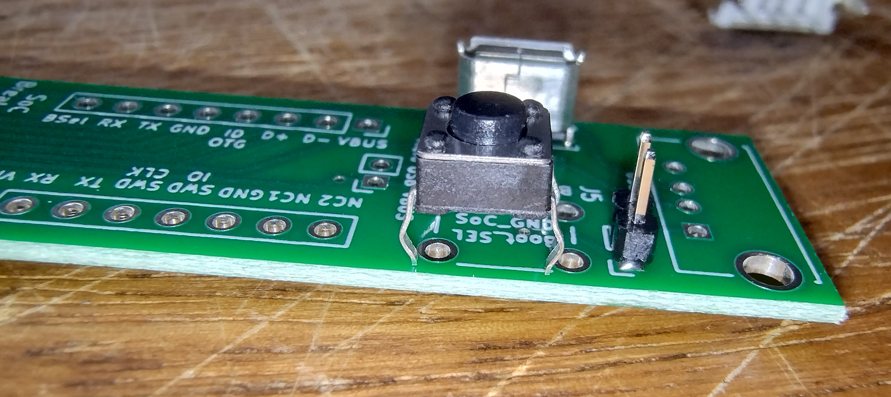](./img/step4.jpg)

Because of those legs, the button will be fixed in place so you won't be needing the USB A port for alignment anymore.

Next up are the 2.54mm pitch breakout headers. Place them on a flat surface and put the PCB on top like this:

[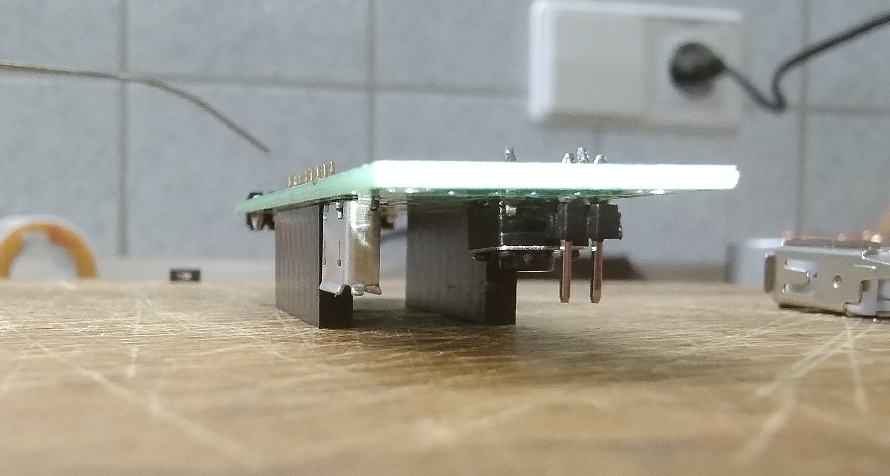](./img/step5.jpg)

Ensure that they're aligned correctly and then start by soldering just a single leg on the outside on each of them like you did in Step 1 to allow for alignment correction.

[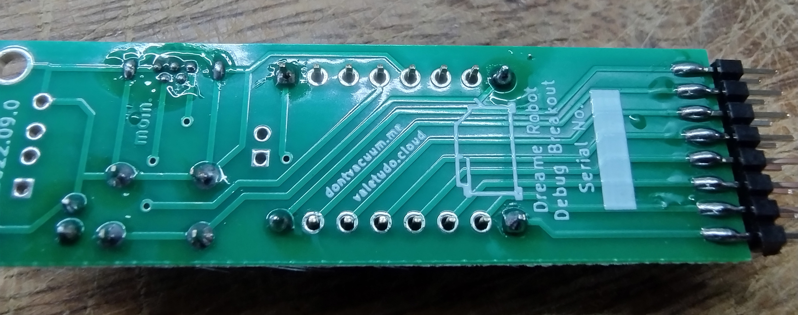](./img/step5.5.jpg)

When you're happy with the alignment, solder the other end of the connector and then continue to fill in the rest of the pins.

To solder the final USB A connector, you will need something else to prop up the PCB. I've used scissors here.
I'm sure you'll find something that has the right height.

[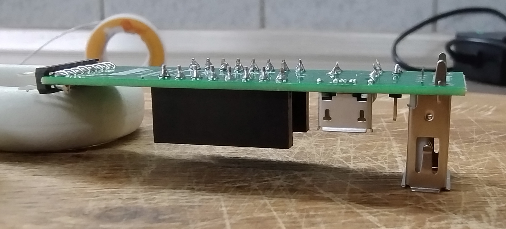](./img/step6.jpg)

As with the Micro USB connector, start with the two large shield connections on the outside, once again, re-check the alignment and realign as needed.
Then, solder the four inner pins.

[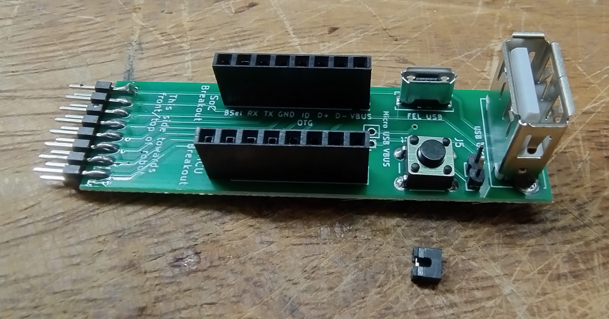](./img/step7.jpg)

Congratulations! You have successfully built a dreame breakout PCB.

If this was helpful to you, there's the option of leaving a tip using [GitHub sponsors](https://github.com/sponsors/Hypfer/).