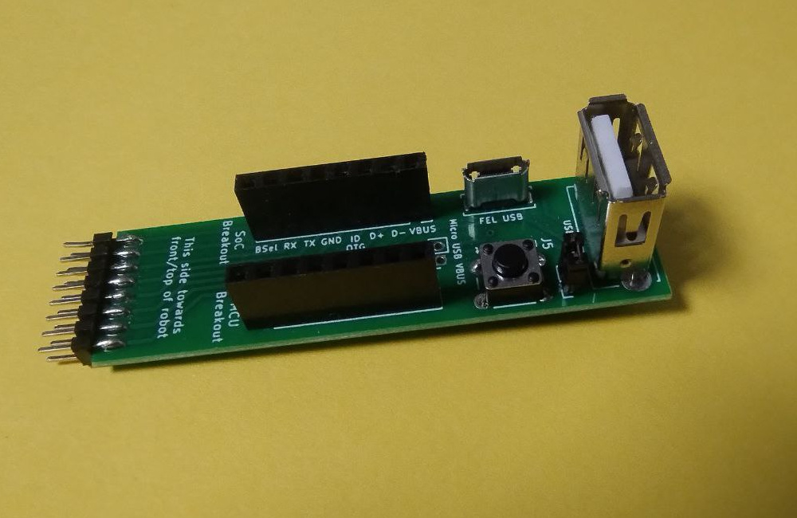

# Dreame Breakout

This breakout PCB takes the 2.0mm pitch 2x8P dreame debug header and breaks that out into a more usable form.

Specifically it provides
- All pins on two 2.54mm pitch headers for use with regular jumper wires etc
- A micro USB socket for flashing stuff via FEL, Livesuit etc.
- A ~~macro USB~~ USB A socket for USB OTG use
- A button to pull BSel to GND to enter FEL
- A jumper to enable USB OTG

**Important:**  
The PCB needs to be manufactured with 1.2mm thickness or else the robot-facing connector won't fit

## Bill of Materials

All the parts required should be available on Aliexpress or similar

- 1x 2.00mm pitch 2x8P male header
- 2x 2.54mm pitch 1x8P female header
- 1x 6x6mm tactile button
- 1x micro usb port
- 1x usb a port

Optional (can also be done via a regular jumper wire using the larger headers):
- 2x 2.00mm pitch 1x2P male header
- 2x 2.00mm pitch jumper

## Assembly

