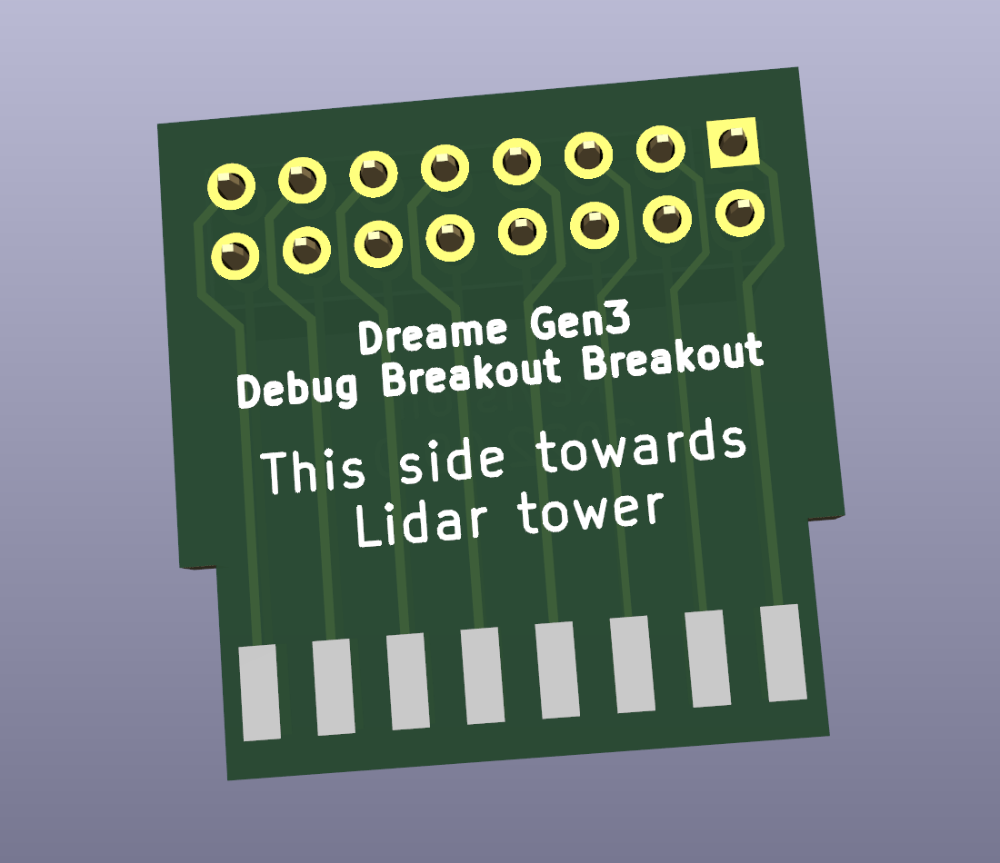
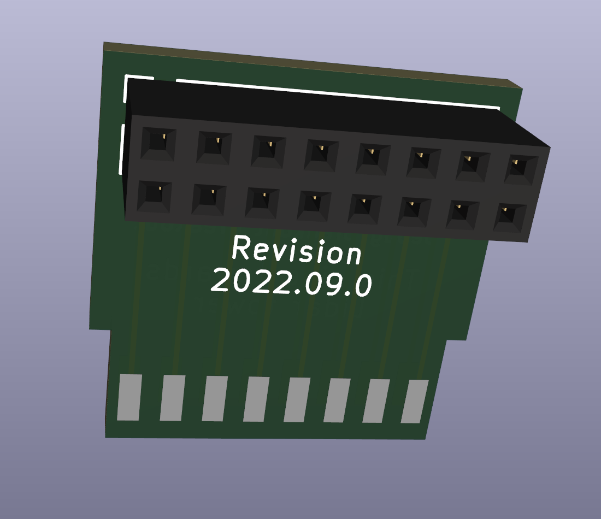
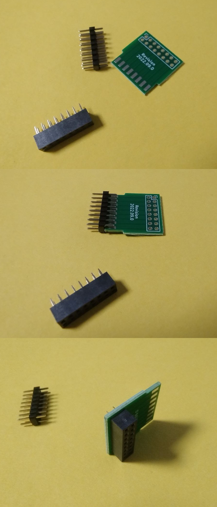

# Dreame Breakout Breakout

On some new robots such as the Dreame L10S Ultra, the debug port is rotated so that the lidar tower cover collides
with the headers on the regular Dreame Breakout PCB.

This breakout breakout solves that problem in a way that greatly amuses me.

## Bill of Materials

All the parts required should be available on Aliexpress or similar

- 1x 2.00mm pitch 2x8P female header
- 1x 2.00mm pitch 2x8P male header

## Assembly

